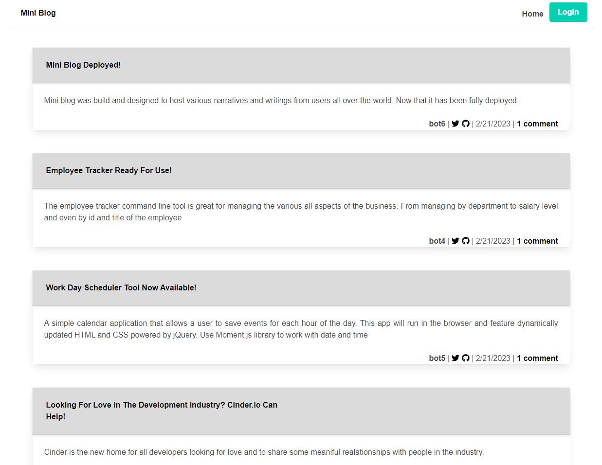

## MVC Tech Blog

Welcome to the MVC Tech Blog, or Mini Blog for short! This application is awesome and ready to use for anyone who wants to enjoy its simple yet awesome features! The purpose of making this appplication was to be bale to showcase a blog website that could be used and accessed by the public. 

Try the application yourself here!---->https://mini-blog-dominic.herokuapp.com/

## Table of Contents

- [Description](#description)
- [Technology](#Technology)
- [Installation](#installation)
- [Usage](#usage)
- [License](#license)
- [Author](#Author)

## Description:

This project was created to host the backend functions of what a common social network platform interaction function has integrated into its software. This code is capable of creating new users and allowing these users to share thoughts as posts, add reactions to these thoughts, creating friends/adding friends and posting thought reactions to friends posts. The program is also capable of get requesting all of this data by individual topic or by user iD as well as deleting. 

## Technology:

Project is created with:

- Javascript
- Node.js
- Express.js
- Bulma
- MySQL
- bcrypt

## Installation

Copy the repo into your own folder.

To run this project, install it locally using npm:

```
npm install
```

## Usage

After installing npm packages, the application will be invoked by using the following command:

```
npm start
```

#### Video Demo

[Click me to see the demo video!](----)

#### Screenshots




## License

[](https://opensource.org/licenses/MIT) <br>
This project is licensed under MIT, for more information please visit [this website](https://opensource.org/licenses/MIT)

## Author

Made by Dominic Paulazzo

- [Email](mailto:dompaulazzo@gmail.com)
- [Github Profile](https://github.com/wevexOP)


