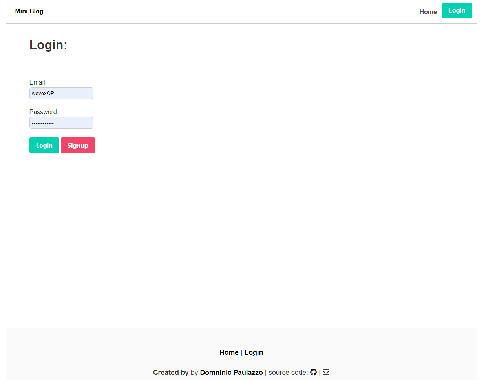

## MVC Tech Blog

Welcome to the MVC Tech Blog, or Mini Blog for short! This application is awesome and ready to use for anyone who wants to enjoy its simple yet awesome features! The purpose of making this appplication was to be bale to showcase a blog website that could be used and accessed by the public. 

Try the application yourself here!---->https://mini-blog-dominic.herokuapp.com/

## Table of Contents

- [Description](#description)
- [Technology](#Technology)
- [Installation](#installation)
- [Usage](#usage)
- [License](#license)
- [Author](#Author)

## Description:

Open the application and explore its simple design easy to use formatting. The Mini Blog is a great place for almost all forms of text. So, it can be used for note taking, to story sharing, and even for news events. 

## Technology:

Project is created with:

- Javascript
- Handlebars
- Node.js
- Express.js
- Bulma
- MySQL
- bcrypt

## Installation

Copy the repo into your own folder.

To run this project, install it locally using npm:

```
npm install
```

## Usage

After installing npm packages, the application will be invoked by using the following command:

```
npm start
```

#### Screenshots




## License

[](https://opensource.org/licenses/MIT) <br>
This project is licensed under MIT, for more information please visit [this website](https://opensource.org/licenses/MIT)

## Author

Made by Dominic Paulazzo

- [Email](mailto:dompaulazzo@gmail.com)
- [Github Profile](https://github.com/wevexOP)


